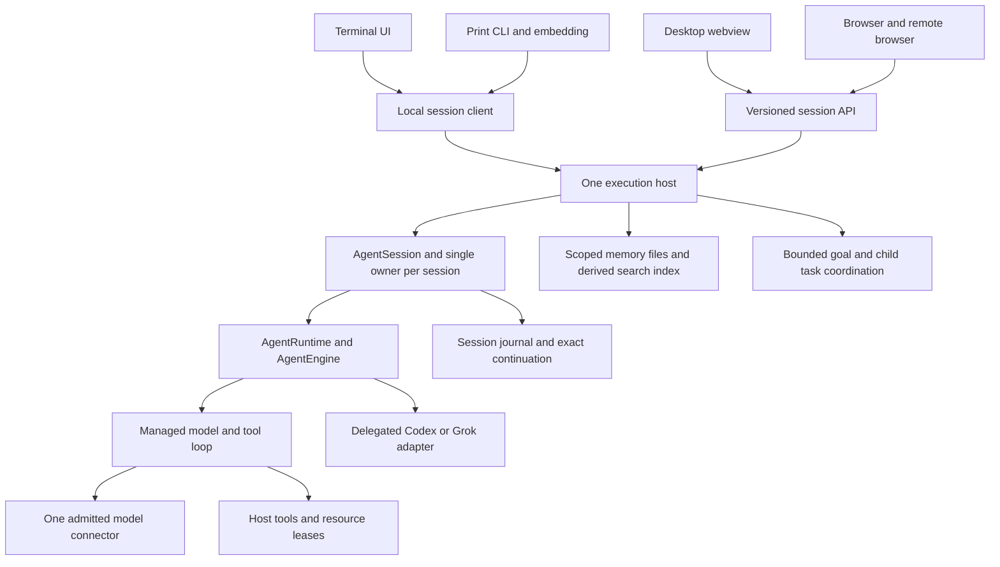
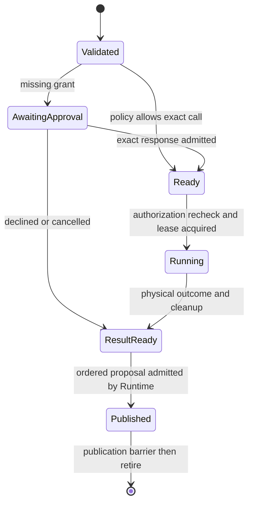

# Yo architecture evolution design

> Status: non-authoritative design proposal; not an activated product contract
>
> 조사 기준일: 2026-10-05
>
> 목표: Pi·Codex와 비교 가능한 코딩 에이전트 경험을 TUI, GUI, 웹에서
> 제공하도록 Yo의 내부 구조와 부족한 기능을 구체화한다. 단순함을 우선한다.

이 문서는 구현을 선택할 수 있는 설계안이다. 지금 구현됐다는 뜻이나
Methexis의 승인된 계약을 변경했다는 뜻이 아니다. 현재 코드와 외부 사례의
근거는 [비교 근거](./evidence.md), 작업 경계와 완료 기준은
[구현 순서와 검증](./implementation.md)에 있다. 별도 표시가 없는 숫자는
측정된 성능이 아니라 검증할 **제안 기본값**이다.

참고 코드를 다시 추적한 범위와 생략·보류 판단은 [29-layer 재검수](./layer-review.md)에 있다.
모듈 분할·공개 API·상태 소유권·변경 파급의 **Pi/Codex/Yo 삼자 대조**와 파일별
이동·유지 기준은 [모듈 설계 비교](./module-comparison.md)에 있다.
사용자 여정과 첫 개선 순서는 [Pi/Codex 기준 사용성 개선안](./usability-comparison.md),
전 영역 작업 목차와 검수 범위는 [전체 검수표](./review-index.md)를 따른다.
TUI 내부의 입력·질문·콘텐츠·탐색·터미널 상호작용은
[64개 요소 상세 검수와 W1–W9 개선 작업](./tui-review.md)에 별도로 정리했다.

후속 [전체 비판 검수](./critical-review.md)는 이 설계의 제품 우선순위를 다시 정했다.
기본 prompt/typed search, 일반·질문 draft 분리, 반복 승인, live rescue export,
설치·PR 검증을 먼저 배달한다. 기존 기능 보존은 사용자 과제 통과의 면제가 아니다.
S0/K0–K2 순서가 이전 문자 단계의 직렬 해석보다 우선하며, 상세 불변조건은 유지한다.

실제 Pi·Codex 소스를 참고한 [TUI ANSI 디자인 예시와 오프라인 갤러리](./tui-ansi/README.md)에
66개 장면, 24–100열 변형, 실패/복귀 상태와 제안 키를 저장했다. 구현된 기능의 화면 캡처는 아니다.

## 1. 선택한 방향

이번 소스 검토에서 Runtime/Engine/Journal의 구별된 책임을 확인해 그 의미 경계를 보존한다.
단일 tool/approval 상태와 TUI-shaped startup 결과는 교체 대상이다. 실행 환경을 조립하는 호스트와 화면을 연결하는
작은 서비스 경계를 추가한다. 네이티브 실행의 프로젝트 이해, 도구 실행,
권한, 작업 지속성을 먼저 강화한다. 웹 화면을 데스크톱에서도 재사용한다.
동시에 현재 TUI의 막힌 첫 연결, 입력 의미, UUID 중심 재개와 결과 검토 진입을
먼저 개선한다. 이 사용성 작업은 host/GUI 구현을 기다리지 않는다.

아래는 런타임 호출·관찰 흐름이다. Cargo 의존 방향은 [모듈 비교 §5](./module-comparison.md)에
별도로 표시하며 core가 concrete backend를 import한다는 뜻이 아니다.



TUI의 셀 렌더러와 웹의 DOM 렌더러는 각각 유지한다. 공유하는 것은
Session·Activity·Request·Task의 의미와 상태다. 기존 Surface HTML projection은
터미널 프레임 확인용으로 유지한다. 접근성 있는 브라우저 제품 전체를
터미널 셀 HTML로 만들지 않는다.

단순함을 유지하는 결정은 다음과 같다.

1. 기존 `yo-core`와 managed loop를 교체하지 않는다. 상태 전환의 소유자는 하나다.
2. GUI·웹이라는 독립 소비자가 생기는 시점에 실행 조립만 `yo-host`로 추출한다.
   초기 client·protocol·server·memory 구현은 그 crate의 모듈이다.
3. TUI는 직접 호출을 계속 쓸 수 있다. 모든 터미널 호출에 daemon을 강제하지 않는다.
4. 한 실행 호스트는 한 OS 사용자에게 속한다. 초기 웹은 개인 호스트의 브라우저
   접근이다. 다중 사용자 SaaS·클러스터·분산 합의는 도입하지 않는다.
5. Journal은 실행 기록의 authority다. Memory 파일은 장기 기억의 authority다.
   검색 DB는 다시 만들 수 있다. 실행 상태와 요약문을 두 번 소유하지 않는다.
6. 도구 병렬 실행과 child agent는 다른 기능이다. 읽기 도구 병렬화를 먼저 한다.
7. 승인 범위를 재사용하되 매 호출의 정확한 실행 권한을 새로 검증한다.
8. 범용 플러그인 버스, vector DB, 범용 DAG workflow engine은 첫 구조에 넣지 않는다.

## 2. 보존·보강·재구성할 부분

| 판단 | 대상 | 구체적인 이유와 조치 |
|---|---|---|
| 보존 | frontend-independent Session/Turn/Activity, Backend·Connector 분리 | 새 화면이 실행 의미를 복제하지 않고 기존 포트를 사용 |
| 보존 | exact replay, binding/context epoch, anchored resume/fork | UI 재접속·모델 교체·장기 작업의 신뢰 기반 |
| 보존 | bounded queues, typed cancellation, terminal restoration | SSH·tmux와 느린 소비자에서도 필요한 제품 품질 |
| 보존 | 원자적 파일 편집, secret 경계, frozen tool registry | 권한 재사용·병렬 실행 때 약화하면 안 되는 기반 |
| 보강 | native project instructions와 context assembly | 현재 한 문장 기본 system prompt에 프로젝트 지침 탐색을 연결 |
| 보강 | typed content/path search | 검색마다 shell 승인이 필요한 경로를 줄임 |
| 재구성 | managed `TurnState`의 단일 active tool/approval | 승인 대기, ready, running, completed를 분리 |
| 재구성 | CLI에 모인 backend/tool/storage 조립 | GUI·웹과 공유할 실제 독립 소비자 경계로 추출 |
| 추가 | process sandbox와 scoped grant | 자동 실행이 승인된 효과 안에 머물도록 실제 실행 제한 |
| 추가 | versioned session API와 reconnect | GUI·웹·원격 TUI가 같은 세션을 관찰하고 조작 |
| 추가 | goal/task state와 scoped long-term memory | compaction 뒤에도 완료 기준과 확인된 학습을 지속 |
| 보강 | diff/artifact 중심 UI, 설치·CI·평가 | 기능 존재를 실제 작업 완료 경험으로 연결 |

`yo-core`에 이미 모델 설정, 로컬 저장소, 지침과 참조 기능이 많다는 이유만으로
전부 밖으로 이동하지 않는다. 새 호스트 추출은 **조립과 OS 효과**에 한정한다.
기존 core 소유자를 바꾸는 정리는 독립적으로 비용·소비자·계약을 검토한다.

## 3. 코드 구조와 책임

목표 구조는 아래와 같다. 새 crate는 우선 `yo-host` 하나이며, `apps/yo-web`은
웹 소비자가 실제로 들어오는 단계에 추가한다.
먼저 현재 CLI 안에서 실행 설정과 neutral Session 준비 결과를 UI 정책에서 분리한다.
아래 트리는 파일 이동 명령이 아니다. Private 상태·의존 방향·공개 면은
[모듈 비교 §5–6](./module-comparison.md)에 따라 제한한다.

```text
crates/
  yo-core/                 # 명령, 상태 전환, Journal, 의미 타입과 포트
  backends/
    foundation/            # 중립 lifecycle, bounded transport/evidence
    managed/               # model loop, ToolBatch scheduler, context assembly
    delegated-codex/        # 검증된 host wire만 번역
    delegated-grok/
  connectors/...           # wire, stream, provider-private replay
  providers/...            # catalog, discovery, account capability
  yo-host/                 # GUI/웹 도입 때 실제 공유 조립을 추출
    src/assembly/          # neutral Session factory와 private concrete wiring
    src/instructions/      # bounded project instruction discovery
    src/tools/             # filesystem/process/MCP host adapters
    src/permissions/       # grant repository + sandbox adapters
    src/service/           # sessions, attachments, controller, snapshots
    src/client/            # 중립 consumer API, local/remote adapter와 오류
    src/protocol/          # versioned wire DTO와 schema generation
    src/server/            # stdio, loopback HTTP/WS, same-origin web assets
    src/memory/            # local memory adapter와 rebuildable index
    src/tasks/             # bounded child sessions, workspace assignment
  yo-cli/                  # grammar, tty interaction, process composition root
  yo-tui/                  # terminal-specific interaction/rendering
apps/
  yo-web/                  # browser DOM UI + desktop webview의 같은 화면
```

`yo-host`는 `yo-tui`를 의존하지 않는다. Core는 concrete backend, connector,
호스트, 웹 프레임워크를 의존하지 않는다. CLI는 process-wide signal/termination
정책을 유지한다. 데스크톱 executable도 자기 process 정책을 소유한다.
`yo-host`는 종료·접속 해제·백그라운드 유지 여부를 명시적으로 받는다.

| 책임 | 의미 소유자 | 효과/구현 소유자 |
|---|---|---|
| Session 상태 전환, Turn, Activity, Request | `yo-core` | worker-owned `AgentRuntime` |
| 한 model response의 tool batch 상태 | managed loop | managed scheduler |
| grant와 exact call authorization 타입 | `yo-core::tool` | host policy store와 admission |
| resource claim, canonical file identity, sandbox | 중립 타입은 core tool port | host의 실행 adapter |
| project instruction snapshot | context/input 의미는 core | host discovery; managed request assembly |
| provider 옵션/모델 capability | core complete profile | provider catalog + connector wire |
| 공용 snapshot과 RPC | 기존 의미를 투영 | host service/protocol; wire 타입을 core에 역수입하지 않음 |
| client attachment와 retry | 중립 consumer 계약 | client adapter; local queue token과 remote unknown 분리 |
| goal/plan/task 의미 | core의 작은 agentic module | host child-session coordinator |
| memory snapshot/scope/revision | core의 admitted input 의미 | host memory CRUD/recall/store/index |
| 화면의 초안, scroll, 선택과 접근성 | 각 frontend | TUI/DOM; 모델 payload 조립은 하지 않음 |

모듈 이동 자체는 동작을 바꾸지 않는다. 추출 전후 CLI의 실제 start, submit,
approval, interrupt, resume, shutdown 경로가 같다는 소비자 검증을 먼저 한다.

조립은 workspace-bound services 준비와 Session 생성의 두 단계로 둔다. Canonical
workspace/config revision에 맞는 지침·registry·model selection 후보를 준비한 뒤
Session을 만든다. 다른 cwd의 services나 mutable settings를 live Session에 덮어쓰지
않는다. Pi의 `createAgentSessionServices`/`createAgentSessionFromServices` 책임 분리를
참고하되 saved model 복원 실패 때 다른 모델을 고르는 SDK fallback은 채택하지 않는다.
공용 factory는 진단과 준비된 handle을 반환하고 process exit/TTY 정책은 실행 파일이
소유한다. 초기화 실패·취소의 owned resource cleanup과 bounded shutdown을 함께 검증한다.

현재 `Config`는 실행 설정과 Theme/PromptTemplates를, `PreparedAgent`는 준비 결과와
TuiAgentConnection/RestoredPromptHistory를 함께 담는다. 실행에 필요한 immutable snapshot과
neutral SessionLaunch/result를 먼저 추출한다. Print가 LiveOptions/TUI connection을 거치지
않게 한 뒤 공유 조립을 이동한다. Service는 bootstrap이 주입한 좁은 factory를 사용하며,
assembly는 session map/controller를 알지 않는다. Process signal/job control/editor는 CLI,
특정 tool child의 spawn/wait/reap은 host adapter에 남긴다.

Codex의 embedded App Server처럼 공용 service 의미는 in-process에서도 쓸 수 있다.
Yo의 direct Session client와 stdio/remote client는 같은 admission/projection port를
사용하되 local call마다 JSON serialize/network hop을 만들지 않는다. 공통 권한과
background HTTP policy는 host 조립에서 먼저 설치하고 각 frontend가 따로 정하지 않는다.

기존 TUI AgentConnection/AgentPoll은 공용 client API가 아니다. TUI 문서·status·link callback과
내부 AgentCommand를 감싼 opaque local PendingCommand를 포함하므로 local adapter 안에서 변환한다. Service session entry가
Session을 소유하고 client attachment는 접근 handle만 가진다. Disconnect는 detach이며 Session
shutdown은 host owner의 별도 정책이다. Local consumer에 WS/HTTP/assets를 강제하지 않도록
transport/schema tooling을 optional build surface로 둔다. 공통 reader port는 실제 remote
consumer를 구현할 때 추출한다.

여기서 `yo-host` crate는 이미 accepted된 Yo Host 의미를 concrete 조립으로 추출하는
후보다. Session Engine/workspace/tools/Journal/Repository 소유권을 다른 두 번째 Host
개념으로 대체하지 않는다. Local in-process와 remote placement는 같은 계약을 쓴다.

## 4. 프로젝트 지침과 모델 문맥

### 지침 탐색

새 네이티브 세션은 명시한 user instruction root와 선택한 workspace의
`AGENTS.override.md` 또는 `AGENTS.md`를 읽는다. 같은 디렉터리에서는 override가
우선한다. repo/worktree root에서 선택 cwd까지 내려가며 적용하고, repo 밖
ancestor는 설정에 명시된 경우에만 읽는다. 임의 부모의 `CLAUDE.md`까지 자동
탐색하는 호환 기능은 별도 옵션이다. 현재 working agreement를 Pi의 탐색
규칙으로 자동 확대하지 않는다.

각 파일은 no-follow, regular-file, UTF-8, byte/depth/count budget 검증을 거친다.
제안 기본값은 파일 32 KiB, 전체 128 KiB, 32개다. 한도를 넘으면 누락 목록과
이유를 보여주고 시작을 거절하거나 사용자가 명시적으로 제외한 새 설정으로
시작한다. 조용히 잘라 중요한 지침을 잃지 않는다.

`InstructionSnapshot`은 source scope, canonical host/workspace identity,
relative source path, content digest와 실제 내용을 가진다. 새 세션의 첫 요청
전에 기록된 replay contract와 연결한다. 기존 exact resume는 저장된 지침을
복원한다. 현재 디스크 내용으로 이전 계약을 덮어쓰지 않는다.

하위 디렉터리의 지침은 모든 파일을 미리 prompt에 넣지 않는다. 첫 구현은
선택 cwd chain만 지원하고 이를 화면에 명시한다. 후속 tool scope 확장은
영향 path에 적용될 지침을 다음 model request 전에 typed snapshot으로 추가하는
별도 계약이다. 해당 계약 이전에는 자동 recursive instruction 지원을 주장하지 않는다.

### 요청 조립

```text
recorded base instructions and tool descriptions
  + selected project instruction snapshots
  + structured current goal/plan projection
  + admitted scoped memory snippets
  + portable context checkpoint and exact retained groups
  + current user input, selected skills/references and media
  + committed model/tool/steer suffix
  -> connector-produced payload -> admitted typed accounting -> dispatch
```

지침·memory·tool output은 실행 권한을 생성하지 않는다. Untrusted source는
본문과 출처로 표시한다. 사용자 지시, 프로젝트 문서, 모델의 계획과 관측된
외부 문장이 서로를 자동 승격시키지 않는다. native와 delegated 양쪽에 같은
지침을 두 번 주입하지 않는다. Delegated host capability에 따라 그 host가
소유하는 프로젝트 지침 로딩을 사용하고 Yo가 주입한 자료의 출처만 기록한다.

현재 compaction의 admitted accounting, protected input, checkpoint epoch, 한 번의 summary,
실패 시 원 상태 보존을 유지한다. 새 goal/memory snapshot의 model-visible 부분도
완성 payload의 token budget에 들어간다. 모델이 생성한 요약은 approval, resource
lease, task terminal state, 테스트 통과 여부의 authority가 아니다.

Text-only strict profile의 exact count와 image profile의 `exact`,
`verified_upper_bound`, `advisory_estimate`를 구분한다. `policy`, `input_estimate`,
`reserve_tokens`와 `quality`를 request assembly, pressure UI와 checkpoint에 그대로
전달한다. 일부 image binding은 이미지가 0개여도 advisory다. Actual usage가 나왔다고
과거 planning quality를 exact로 바꾸지 않는다. Advisory admission은 서버 수용 보장이 아니다.

## 5. 도구, 승인, sandbox와 병렬 실행

### Typed search

첫 추가 도구는 `search_content`와 `find_paths`다. Workspace-relative scope,
literal 기본 검색, 명시적인 regex mode, ignore policy, continuation cursor를
갖는다. 출력은 path, line, bounded excerpt, cursor, truncated/error reason이다.
제안 상한은 호출당 200 matches, model-visible 64 KiB, file 4 MiB, 탐색 파일
100,000개다. 정렬과 cursor는 host/workspace·query·inventory generation에 결합한다.
검색 중 변동을 snapshot이라고 주장하지 않으며 cursor stale은 재검색을 요구한다.

현재 no-follow 파일 경계, credential 제외와 semantic output admission을 재사용한다.
Regex에는 bounded engine/complexity 검증이 필요하다. 인덱스가 없어도 동작하는
좁은 도구로 시작한다. 프런트엔드 `@` 파일 인벤토리는 검색 실행의 권한이 아니다.

### 승인 범위

기존 `ToolApprovalBinding`은 exact Turn/call/tool/args/effect/host에 결합되어 있다.
그 binding을 다음 호출에 재사용하지 않는다. `PermissionGrant`에 맞는 호출마다
새 exact authorization을 생성하고 **dispatch 직전** 재검증한다.

```text
PermissionGrant:
  id, revision, issuer, host_id, workspace_id
  permitted_tool_identity_and_revision
  bounded_action_and_resource_scope
  lifetime: this_task | this_session | explicit_persistent_rule
  expiry, revocation_generation, optional child delegation ceiling

CallAuthorization:
  exact ToolApprovalBinding
  matched_grant_id_and_revision OR exact human decision
  sandbox_profile_digest + admitted_resource_claims
```

C의 실제 입력 연결은 버전 있는 structured process tool을 첫 후보로 선택한다.
현재 `run_command`의 shell 문자열에는 executable/argv scope가 없으므로 grant 저장소만
추가해서 routine 실행이 자동화됐다고 하지 않는다. host가 executable/literal argv/cwd와
환경·sandbox profile을 확정하고 권한 판정에 넘긴다. interpreter를 호출하는 structured
argv도 효과가 넓을 수 있다. 기존 shell은 명시 승인 경로로 유지하며, fixed command wrapper만
먼저 지원하는 대안을 택하면 자동화 범위도 그 wrapper로 제한한다.

Frontend는 `이번 호출`, `현재 작업 범위`, `이 세션`, `명시적 규칙 저장` 중
호스트가 실제 지원하는 선택지만 보여준다. UI label은 허가 범위를 확대하지 않는다.
첫 grant 단계 C는 exact call, Session scope와 명시적 저장 규칙만 지원한다.
`this_task`와 child delegation ceiling은 F2의 typed Task identity/lifecycle이 있어야
노출한다. Resume는 별도 persisted grant와 현재 host/workspace/tool revision,
expiry/revocation을 재검증한다. Replay·지침·memory는 권한 복원 근거가 아니며
fork는 parent grant를 암묵 상속하지 않는다.
기본은 현재 Session의 workspace 범위 내 파일·검색과 검증된 sandbox 안의 routine
명령이다. 외부 path, network destination, destructive repository operation,
credential 접근은 별도 명시 scope가 있어야 한다. 모든 경로에서 매번 사람이
승인하는 정책을 기본 제품 경험으로 강제하지 않는다.

추가 모델을 호출하는 auto-review를 모든 도구의 기본 경로에 삽입하지 않는다.
허용된 scope·effect·sandbox를 증명하면 host policy가 판정하고, 미해결 scope만
exact 승인 요청으로 보낸다. Review가 필요한 새 제품 정책을 도입한다면 latency와
별도 모델 비용을 측정해 선택한다. Codex의 strict auto-review도 승인 skip과 별도
계층이며, 병렬 runtime이 모든 approval wait를 제거하는 증거는 아니다.

Shell 문자열 prefix 비교만으로 영구 허가를 만들지 않는다. 구조화된 executable,
argv, cwd, environment policy와 sandbox가 확인된 명령에 한해 제한 규칙을 지원한다.
불투명 shell script/MCP call은 좁은 effect 범위를 증명하지 못하면 exclusive다.
MCP readOnlyHint와 AGENTS.md 문구는 권한 증거가 아니다.

### 실제 실행 제한

권한 재사용에는 나중에 확인하고 철회하는 경로도 포함한다. C의 제안 `/permissions`는 현재
host/workspace에 적용되는 grant의 lifetime/expiry, tool/resource/sandbox 범위와 상태를
list/read/revoke한다. Tool 상세에는 이번 호출이 매칭한 grant ID/revision 또는 승인 필요
사유를 bounded·redacted provenance로 보여준다. 임의 규칙 편집기는 먼저 만들지 않으며 범위
확대는 새 명시적 승인으로 처리한다.

Revoke는 host permission-store owner가 exact grant ID, expected revision과 authorized actor를
검증하고 persistent grant의 generation-CAS를 durable하게 반영한다. 이후 dispatch revalidation은
queued call도 다시 검사한다. 이미 시작한 효과의 취소 보장은 adapter capability로 따로 표시한다.
D는 같은 list/read/revoke를 optional service API로 노출한다. Controller 권한 회수와 tool grant
철회는 서로 다른 동작이다. 저장→반복 사용→상세 확인→대기 중 철회→restart 후 계속 철회 상태라는
여정을 C의 완료 조건으로 둔다.

Process approval은 OS sandbox가 아니다. `SandboxAdapter`는 filesystem roots,
network destinations, environment/credential exclusion, child processes와 cleanup
제약을 수행 전에 확인하고 적용한다. Linux/macOS adapter는 검증된 OS/helper
경계를 사용한다. Yo 자신의 safe-Rust 규칙을 무시하는 syscall 코드를 추가하지 않는다.

사용 가능한 adapter와 지원하지 못하는 restriction을 capability로 반환한다.
제한을 적용할 수 없으면 그 profile의 자동 실행을 거절한다. 기존 승인형
unsandboxed 실행은 명시된 기존 모드로 표시하며 sandbox처럼 설명하지 않는다.
이를 자동 허가형 모드로 조용히 낮추지 않는다. SSH/tmux 실행에서는 터미널
호스트가 아니라 실제 실행 머신의 adapter/canonical identity를 사용한다.

### Tool batch scheduler

제품 수락 범위 주의: 현재 기본 registry의 파일 작업은 automatic이고 승인이 필요한
`run_command`는 opaque Process다. 아래 disjoint 승인 예제는 좁은 effect/claims가 실제
제공될 때 성립하며, 현재 shell 승인 중 같은 workspace read를 진행시키는 사례가 아니다.
B는 read batch 병렬화를 검증하고, 반복 승인 감소는 A의 typed search와 C의 grant 정책으로
별도 측정한다. 모든 approval 지연을 slot 분리만으로 해결했다고 판정하지 않는다.



`ToolBatch`의 원본 상태는 model source index별 slot enum이며 pending request/ready/running
index는 여기서 파생한다. 서로 독립적인 mutable map을 authority로 두지 않는다. 첫 구현의 동시 실행 상한은
Session당 4개 read-only tool, host당 8개다. 실행은 parallel일 수 있으나 Journal
append는 session worker 한 곳에서 한다. 모든 결과를 source index 순서로 모델에
반환한다. tool validation failure/decline도 해당 call slot을 정확히 닫는다.

Managed는 ordered BackendEvent를 제안하고 Runtime이 의미 검증·Journal publication을 수행한다.
Scheduler는 publication barrier 뒤에만 slot을 retire한다. 먼저 기존 event drain→후속 poll의
barrier를 명문화하고, 독립 poller를 도입할 때 exact generation/index acknowledgement를 추가한다.
Physical result readiness는 semantic commit이나 durable 저장 완료를 뜻하지 않는다.

Running count와 별도로 **4-slot sliding reorder window**를 둔다. 가장 앞의
미-retire source index부터 4 slots 안에서만 eligible call을 dispatch한다. 완료된
slot도 용량 예약을 유지하며 source-order semantic admission, Journal outcome commit,
model replay publication 뒤 retire한 만큼 다음 index를 연다. Batch 전체의 기존
1,024-item bound를 4로 바꾸거나 나머지 call을 error로 바꾸지 않는다. 앞 approval이
느리면 window 안 독립 read는 진행할 수 있고 window 밖 호출은 용량 때문에 기다린다.

Slot은 기존 per-call model output 4 MiB와 retained output 8 MiB allowance를 dispatch
전에 예약한다. 기본 window의 raw result payload allowance 합계는 48 MiB이며,
설정을 바꾸면 checked product로 다시 계산한다. 이 값은 JSON scratch나 전체 RSS
상한이 아니다. 기존 argument/container, semantic output, encoded replay/checkpoint
한도는 각각 유지한다. B부터 coordinator의 live worker Session 상한도 8개로 둬
Session마다 무한 completed buffer를 만들지 않는다. 용량 부족은 새 dispatch 대기이며
숨은 truncation이 아니다. 역순 physical result readiness는 bounded volatile progress로
표시하고 semantic Activity terminal·Journal tool result는 source 순서를 지킨다.

Host가 확정한 canonical resource claim은 `SharedRead(file/tree)`,
`ExclusiveWrite(file/tree)`, `ExclusiveWorkspace`, `ExclusiveExternal`이다.
path 문자열이 다른 것만으로 독립이라고 판단하지 않는다. rename, hardlink,
symlink, 디렉터리 하위, git metadata와 child process 효과를 고려한다.
처음에는 writes와 shell을 exclusive로 두고 read-only batch만 parallel한다.

Lease·fairness·ordering 보장은 **같은 coordinator에 참여하는 Session** 사이에
한정한다. 별도 direct CLI process와 외부 editor는 그 lease에 참여하지 않는 writer다.
Changed-target/observed-stale evidence를 사용하되 OS 사용자 전체의 atomic CAS나
충돌 방지를 주장하지 않는다. 초기 구조에 전역 lock service나 강제 daemon을 추가하지 않는다.

대기 중인 호출은 실행 슬롯과 mutable lease를 점유하지 않는다. 다만 **원래 앞선
호출의 순서 제약**은 유지한다. 앞선 write/shell/불투명 호출의 reserved claim과
겹치는 후속 read는 먼저 실행하지 않는다. 앞선 요청과 resource·approval 의존성이
없다고 증명한 read는 승인 답변을 기다리지 않고 실행한다. Claim을 모르면
exclusive로 판단한다. Fairness는 eligible call의 source order와 round-robin
polling으로 보장하고, write starvation을 막는다.

SharedRead끼리는 같은 파일을 읽어도 겹쳐 실행할 수 있다. 승인이 필요한 기본
`run_command`는 workspace-exclusive이므로 그 승인을 기다리는 동안 같은
workspace read가 진행된다는 효과는 이 scheduler만으로 얻지 못한다. 그런 흔한
승인 병목은 typed search 또는 sandbox로 좁힌 명령 scope와 grant 단계에서 줄인다.

예: read A, approval 대기 중인 write B, read C에서는 B/C가 겹치지 않고 host가
확정한 scope 안이면 A/C를 진행한다. 승인 대기 중인 arbitrary shell, read C에서는
shell의 workspace claim과 C가 겹치므로 대기한다. 두 경우를 동일한 병목 제거로
포장하지 않는다.

새 model round는 해당 batch의 모든 call 결과가 확정된 뒤 시작한다. Esc/interrupt는
새 dispatch를 막고, running 작업 cancel·cleanup·Activity seal을 수행한다.
중복 승인, revoke 이후 승인, 늦은 완료, cancel/complete race는 exact request와
generation으로 거절하거나 terminal 상태를 한 번만 관측한다. 외부 효과의
exactly-once를 주장하지 않는다. Crash 후 uncertain effect는 자동 재실행하지 않는다.

### Registry와 MCP

Frozen registry에 새 기본 도구를 추가하면 이전 registry로 저장된 세션을 그대로
복원할 수 있도록 revision compatibility를 별도로 유지한다. 새 tool visibility는
다음 admitted contract boundary에서만 바뀐다. Model-visible schema와 실행 artifact
digest, server identity를 함께 고정한다.

MCP는 stdio를 먼저, HTTP는 그 다음 도입한다. Transport/auth/progress/cancel은 host
adapter, tool call/result 의미는 core/managed 경계다. reconnect·schema drift·server
replacement는 기존 도구로 간주하지 않는다. Dynamic discovery 결과를 tool catalog로
노출하고 필요한 작은 도구 집합만 model-visible registry에 선택한다.

서버의 시작·연결은 개별 tool call보다 먼저 일어나는 별도 효과다. 첫 G는 사용자가
명시적으로 설정한 server identity/launch profile만 받는다. Spawn/connect 전에
실행 artifact·argv·cwd·environment/credential allowlist와 **서버 생존 기간 전체의**
sandbox/effect ceiling을 검증한다. 프로젝트 문서·model output·discovery 결과만으로
서버를 시작하지 않는다. 초기화와 호출 사이의 background 효과도 그 ceiling에 속한다.
기존 승인된 profile은 재사용하되 reconnect/replacement에서 identity와 revoke 상태를
재검증하고 revoke/shutdown은 bounded process-tree cleanup을 수행한다. 후속 HTTP의
destination/auth 허가는 remote server 내부 효과의 confinement 증거가 아니다.

첫 G의 persistent stdio profile은 workspace read-only와 겹치지 않는 전용 server state
write로 제한한다. 초기화·background 작업·child process에도 같은 ceiling이 적용된다.
전용 state는 workspace/Git/credential/다른 server state와 alias하지 않는다. 호출 밖에서
workspace나 공유 external resource를 변경할 수 있는 profile은 spawn부터 cleanup 확인까지의
lifetime exclusive claim 또는 실제 host effect broker 없이는 unsupported다. 첫 G는 이런
mutating profile과 broker를 미룬다. Call lease는 요청 ordering에만 적용하며 server의
cache/background read를 point-in-time workspace snapshot으로 설명하지 않는다.

Registry에 선택하기 전 transport와 discovery도 제한한다. 제안 default는 host당
server 8개, inbound frame 1 MiB/JSON nesting 32, server catalog 합계 8 MiB/2,048 items,
100 pages/cursor 64 KiB, start+initialize+discovery 전체 deadline 30초다. Frame byte는
parse 전에, nesting은 decode 중, aggregate limits는 다음 page를 수락하기 전에 검사한다.
반복 cursor·첫 초과·oversized unsupported content는 해당 서버를 unavailable로 닫고
진단/stderr 보관도 bounded하게 유지한다. Cancel/cleanup은 local tools와 다른 Session의
진행을 막지 않는다. 이 값들은 upstream parity 수치가 아닌 검증할 Yo profile이다.

첫 MCP profile은 기존 closed `yo.tool-schema/v1`을 정확히 통과하는 schema와 bounded
text result만 지원한다. `$ref`, `oneOf`, `default` 등 미지원 키워드를 삭제하거나
coerce해서 registry에 넣지 않는다. Catalog에 unavailable 이유를 표시한다. Image,
resource, structured content는 성공한 text 결과로 위장하지 않고 명시적 unsupported
content outcome/availability로 닫으며 resource URI를 자동 fetch하지 않는다. 넓은 schema와
multimodal result 지원은 별도 계약 delta이며 stdio 연결 성공을 full MCP parity라 부르지 않는다.

첫 MCP profile은 유용한 실제 server와 tool inventory 하나를 지정해 호환 수락을 입증한다.
합성 initialize/list fixture만 통과하면 restricted experimental adapter다. 해당 실제 inventory의
schema/content/effect가 현재 profile에 맞지 않으면 버전 있는 profile 확대 또는 명시적 미지원을
선택한다. 모든 real server가 실패한다고 단정한 것은 아니며 실제 호환 corpus는 아직 미실행이다.

G의 사용자 진입도 함께 구현한다. `yo mcp`의 add/list/status/connect/recheck/stop/remove는
제안 CLI 관리면이고, TUI `/mcp`는 상태·사용 가능 도구·실패 이유와 가능한 다음 행동을 연다.
등록/연결 실패는 입력한 비밀이 아닌 설정 선택을 유지하며 수정/재확인/취소로 돌아온다.
관리 동작은 host lifecycle owner를 통하고 stop은 진행 중 호출의 cancel/cleanup까지 표시한다.
Remove는 해당 설정의 명시적 제거이며 실행 이력을 삭제하지 않는다. Secret 설정은 기존 보호
경로를 사용하고 첫 DOM은 지원 상태/설정 안내/다시 확인까지만 제공할 수 있다.

Live Session의 frozen registry는 관리 화면에서 바꾸지 않는다. 추가/변경된 catalog는 다음
Session 또는 명시적으로 허용된 새 registry 경계에만 적용한다. 현재 연결 중지는 기존 도구를
unavailable로 만들 수 있음을 보여주고, schema/capability 불일치는 구체적인 이유로 표시한다.
관리면의 각 mutation도 권한·scope·현재 server identity를 검증하며 서버 등록을 unrestricted
process 실행 동의로 확대하지 않는다.

Code execution을 통한 다수 tool orchestration은 측정된 tool-schema 비용이 병목일 때
MCP 뒤에 도입한다. 모든 내부 call에도 기존 권한·lease·budget·audit가 적용되어야 한다.
JS executor가 권한 경계를 우회하거나 범용 node process를 새 기본 도구로 만들지 않는다.

## 6. 엔진과 에이전틱 작업

Native plan을 작은 mutation owner와 기존 ActivityPlan projection으로 먼저 제공한다(F1a).
현재 ActivityPlan은 관측 표시이므로 native plan 실행을 이미 지원한다고 세지 않는다.
Hard Goal budget은 F1b, funded child는 F2이며 plan 첫 배달의 선행 조건으로 묶지 않는다.
어느 경우에도 plan step 완료는 실제 검증/Goal 성공을 대신하지 않는다.

한 Session의 active Turn은 하나로 유지한다. 모델 loop 안의 여러 round와 여러
tool call을 Turn과 혼동하지 않는다. Session 병렬성과 한 batch 병렬성은 별도다.

`Goal`은 objective, constraints, acceptance criteria, status, remaining budget,
linked task IDs를 갖는다. `Plan`은 bounded ordered steps와 current step을 갖는다.
각 step의 완료에는 결과 참조와 verification availability가 따른다. 모델의
`completed` 문장만으로 검증이 완료되지 않는다. 첫 구현은 Goal과 Plan을 같은
작은 agentic module의 별도 타입으로 둔다. 외부 workflow framework를 쓰지 않는다.

`Task`는 독립 child Session으로 실행한다. Parent-child link, captured input/context
digest, owner, workspace assignment, admitted grant ceiling, outcome/artifact refs를
기록한다. 기본 child limit 2개, depth 1, 동일 host 총 active sessions 8개다.
능력에 맞는 모델을 명시 선택하며 숨은 provider fallback을 쓰지 않는다.

Task spawn은 기존 intentional `/fork`가 아니라 **fresh Session + bounded task seed**다.
기존 fork의 idle parent·pending request 없음·same-workspace 조건은 유지한다. Task seed는
objective/constraints와 선택한 중립 context fragment의 실제 bytes를 저장한다.
`TaskOrigin`은 task ID, parent Session/Goal revision, Journal source refs와 digests를
보존한다. Seed의 전체 encoded 크기는 기존 admitted input/context bounds를 넘지 않는다.
Pending effect, provider-private replay와 parent 실행 권한을 문맥으로 상속하지 않는다.
Parent 없이도 child의 seed/history는 복원되며 권한·budget은 별도로 재admit한다.

Child 생성은 `preparing → admitted → running → terminal`로 구분한다. Capacity와
budget을 예약하고 durable preparing task/link를 기록한 뒤 workspace/Session 후보를
준비한다. Child identity를 link에 확정한 다음 initial input을 제출하고 worker
acceptance가 확인돼야 실행 중 task로 공개한다.
Acceptance 전에 실패·취소되면 후보 child를 종료하고 lease/slot과 아직 dispatch하지
않았음이 확인된 budget reservation을 해제한다. Acceptance가 불확실하면 reservation을
유지하고 unknown outcome을 기록한다. Cleanup 실패는 숨기지 않고 child/workspace
handle과 typed recovery action을 남긴다. 사용자 파일이나 retained patch를 자동 삭제하지 않는다.

F1a의 standalone native Plan은 해당 Session worker와 그 Journal이 소유하며 Goal이나
parent를 요구하지 않는다. Child Session의 plan도 해당 child Session이 소유한다.
F1b/F2에서 parent Goal/TaskLink/BudgetReservation은 parent Session worker가 쓰는
closed Journal extension이 소유한다. Child Journal은 자기 plan 외에 immutable
TaskOrigin/seed/input/terminal을 소유한다. Host coordinator의 maps는 두 Journal에서 재구축하는 projection이며
별도 terminal-state DB나 범용 transaction log를 만들지 않는다. 현재 Journal에
이 record가 있다고 주장하지 않으며 persistence owner의 명시적 schema delta가 필요하다.

Dispatch 순서는 parent reservation/preparing → child identity/link 확정 → child seed/origin
저장 → child input acceptance → parent의 correlated running publication이다. 각 중간
crash는 task ID와 정확한 Journal coordinates로 join한다. Join이 없거나 모순되면
unknown이며 child 재생성·자동 redispatch·reservation 환불을 하지 않는다. Child terminal
evidence가 durable하고 parent가 한 번 reconcile한 뒤에만 사용량/남은 allowance를 확정한다.

Goal budget의 owner는 parent의 구조화된 Goal state 한 곳이다. Parent, child,
compaction, continuation과 admitted retry 모두 같은 allowance에서 reservation을
받는다. 동시에 남은 budget을 읽어 두 child가 각각 전부 소비하지 않도록 dispatch
전 reservation을 serialized durable record로 차감한다. 완료 usage는 그 reservation에
한 번 reconcile하고, usage가 missing/unknown이면 0으로 환불하지 않고 예약을 유지한다.
재시작은 기록된 remaining/reservations/deadline을 복원하며 fresh budget을 부여하지 않는다.
Unknown reservation의 해제나 allowance 확대는 명시적 budget 변경이다.

Goal 상태는 `active`, `paused`, `needs_input`, `completed`, `cancelled`, `failed`로
닫는다. Pause는 새 continuation/child dispatch를 막는 제어이고, 이미 실행 중인
작업의 interrupt 여부를 명시한다. Completion은 모든 criterion의 evidence가
충족됐을 때만 가능하다. Task의 terminal outcome과 Goal의 완료는 다르다. 예컨대
child가 성공해도 parent의 regression criterion이 미확인이라면 Goal은 active다.
Plan step과 완료 증거는 model summary가 덮어쓰지 않는 revision-CAS record다.

F1b/F2의 사용자 제어면은 optional capability로 함께 도입한다. TUI `/goal`은 목표·완료 기준·
예산과 start/pause/resume/cancel/budget 변경을, `/tasks`는 child의 상태·실행 위치·결과와
지원되는 interrupt를 제공한다. Goal 생성은 사용자가 실제로 지속 작업을 요청한 경우이며
일반 질문마다 Goal을 만들지 않는다. 새 Goal/예산 변경은 적용할 값을 보여주고 명시한 행동으로
제출한다. Child 성공과 parent 완료를 같은 badge로 표시하지 않는다.

Local service와 wire의 `goal/create/read/update/pause/resume/cancel`,
`goal/set-budget`, `task/list/read/interrupt`는 해당 worker-owned command로 변환한다.
Mutation은 exact Goal/Task identity, expected revision, actor/controller와 operation ID를
검증하고 admission/terminal outcome을 분리한다. Stale revision이나 거절은 편집 값을 보존해
다시 확인하게 한다. Task join은 parent worker의 exact reconcile이며 UI의 별도 완료 쓰기가
아니다. Optional profile이 없으면 해당 행동을 숨기거나 미지원 이유를 표시한다.

첫 hard limit의 단위는 backend가 실제로 dispatch 전에 통제할 수 있어야 한다.
Managed에는 Yo가 승인하는 logical model request/round 상한과 선택적 wall-clock
deadline을 제공한다. Connector 내부 retry attempt까지 hard로 셀 때는 verified 최대
attempt allowance를 선예약하거나 per-attempt dispatch permit이 필요하다. 이 evidence가
없으면 내부 attempts는 planning/unknown이며 기존 no-retry 계약은 유지한다.
Delegated는 검증된 native enforcement가 있기 전까지 Yo Turn/child admission count와
새 dispatch deadline만 집행한다. 내부 model rounds/retries/tokens/spend의 사후 notice를
hard reservation으로 해석하지 않는다. Hard model-round Goal의 child spawn/model replace는
지원하지 않는 delegated binding을 거절하며 단위를 조용히 Turn으로 바꾸지 않는다.
Token allowance는 verified input upper bound와 output/retry cap이
있을 때만 hard로 집행한다. Advisory image count, unknown output maximum이나
불확실 usage가 있으면 token/spend는 planning limit이라고 표시하고 hard billing
보장을 하지 않는다. Persisted deadline과 현재 clock을 안전하게 비교할 수 없으면
자동 continuation을 거절한다. 예산이 없다는 설정도 명시적으로 보존한다.

Ordinary·active/idle compaction·protected request를 private request admission/dispatch 경계로
모으고 각 대상 요청의 dispatch 전에 exact budget permit을 소비한다. Dispatch 후의
ModelRequestAccepted는 사전 허가가 아니다. GoalLedger는 worker-private 상태이며 backend의
permit 요청→worker reservation→응답을 단계화한다. 같은 worker나 parent writer를 기다리는
동기 callback을 추가하지 않는다. Protected request의 payload-free receipt barrier를 유지한다.

읽기 조사는 workspace 공유가 가능하다. 동시 쓰기는 explicit file/resource ownership
또는 별도 Git worktree가 필요하다. Worktree는 파일 충돌을 줄이는 구조이며 sandbox가
아니다. Credential/network permission은 별도로 적용한다. Dirty source 보존, branch
assignment, shared Git metadata lock, bounded build output, retained patch를 갖는다.
자동 merge/push/delete는 child completion의 부수효과로 넣지 않는다.

Child는 결과와 근거 참조를 parent에 반환하고 parent의 Journal/메모리/실행 권한을
직접 변경하지 않는다. Child grant는 parent ceiling의 부분집합이다. Parent revoke는
아직 시작하지 않은 child dispatch를 막고, 실행 중 revoke 처리도 adapter 계약에
따른다. Parent의 interrupt는 child에 전파하되 독립 background 유지가 요청된 task는
그 선택과 표시를 기록한다.

Background child가 살아 있으면 host는 parent writer/budget owner도 유지한다.
Parent가 unavailable이면 self-contained child history는 읽을 수 있지만 parent-funded
자동 continuation은 중지한다. Standalone으로 분리하는 동작은 명시적인 새 scope/budget
설정이며 첫 child 구현의 implicit ownership transfer로 넣지 않는다.

장기 goal continuation은 확인된 safe boundary에서 다음 입력을 생성하는 host 정책이다.
새 작업·검증·측정된 변경 또는 구체적으로 살아 있는 실행 handle의 wait만 progress다.
설명 반복은 progress가 아니다. 제안 기본 반복 상한은 3회 no-progress이며, 그때
`needs_input` 또는 typed failure로 멈춘다. 완료는 acceptance criteria마다 확인된
근거가 있어야 한다. 강제된 시간/token 한도, pause와 cancel은 completion과 분리한다.

프로세스 crash에서 재개 가능한 것은 검증된 Session boundary와 task descriptor다.
Pending shell이나 external MCP 효과를 자동 재실행하지 않는다. Background daemon의
작업 지속과 power-loss 뒤 부작용 재실행 보장은 서로 다른 기능이다.

## 7. 메모리 시스템

### 네 종류를 구분한다

| 정보 | Authority | 복구와 사용 |
|---|---|---|
| Session 원문과 효과 기록 | 기존 Journal | exact replay, history와 진단 |
| 현재 Goal/Plan/Task 상태 | 구조화된 agentic records | compaction 이후에도 owner에서 재투영 |
| 모델 context checkpoint | 기존 portable summary + retained groups | 모델 입력 크기 조절; 원문 대체 authority 아님 |
| 프로젝트/사용자 장기 기억 | scoped memory entries | 다음 대화의 선택적 recall |

메모리 service나 vector DB를 추가하지 않는다. 첫 장기 기억 저장은 사용자 state
root 아래 `memory/<scope>/<entry-id>.md`다. Closed bounded metadata에 id, scope,
host/workspace identity, revision, created/verified time, kind, source references,
source hashes와 status를 둔다. 본문은 짧은 UTF-8 Markdown이다. 제안 budget은
entry 16 KiB, scope 1,000 active entries, request recall 8 entries/8 KiB다.

첫 scope identity는 host + canonical workspace tuple이다. 다른 Git worktree는 별도
scope다. 같은 remote/branch/repository라는 추정으로 recall/grant를 공유하지 않는다.
Child가 parent memory를 필요로 하면 explicit ceiling 안의 선택된 snapshot만 task seed로
받는다. Child의 새 recall/contribution은 자기 scope이며 parent memory 직접 수정은 없다.
Logical project alias와 자동 cross-worktree sharing은 필요가 확인된 뒤 명시 opt-in으로 도입한다.

Recall selection, contribution/CAS, derived indexing은 host memory의 별도 모듈로
분리한다. Codex처럼 read/write를 분리하는 책임은 취하되 처음부터 별도 crate,
startup model extraction, global consolidation agent나 DB job queue를 만들지 않는다.

`host::memory::MemoryRepository`는 list/search/read/compare-and-swap/forget을 지원한다.
Core에는 admitted immutable snapshot, scope/revision/provenance와 필요한 최소 admission
capability만 둔다. 검색·CRUD/index·writer lock 전체를 core public port로 올리지 않는다.
새 revision은 same-directory atomic replacement와 generation CAS로 공개한다.
CAS·forget·scope revision update는 같은 cross-process writer lock과 transaction
intent/recovery lane을 사용한다. Forget은 durable tombstone와 scope generation을
먼저 기록한 뒤 본문과 파생 index를 제거한다. Stale writer는 tombstone 또는
generation mismatch를 만나 거절된다. Deleted entry ID는 재사용하지 않는다.
Tombstone/intent가 capacity bound에 닿으면 유지보수 또는 typed pressure를 요구하고
조용히 삭제해서 오래된 writer를 허용하지 않는다. 동시 writer가 overwrite하거나
forgotten entry를 되살리지 않는다. 초기 검색은 bounded metadata/literal scan이다.
규모가 커지면 SQLite FTS를 추가하되 파일 hash와 index generation을 확인하는
파생 cache로만 쓴다. Index가 stale/손상되면 rebuild하거나 파일 기반 bounded search로
동작한다. Search 누락을 complete 결과라고 주장하지 않는다.

### 저장과 recall

사용자가 명시한 선호와 확인된 프로젝트 사실은 허용된 scope에 저장할 수 있다.
모델 추론은 `candidate`, 관측된 사실은 source-backed `observed`, 사용자가
명시한 선호는 `user_stated`로 구분한다. `user_stated`를 모델이 발명하지 못한다.
작업마다 모든 memory 저장을 재승인하지 않는다. 사용자가 설정한 contribution
범위와 기존 쓰기 권한 안에서 실행한다. Scope 확대나 전역 선호 변경은 그에 맞는
명시적 사용자 지시가 필요하다.

초기 default는 같은 workspace의 검증 가능한 기억 사용을 허용하되 contribution은
사용자가 켠 workspace에만 허용한다. 전역 user scope로의 자동 승격은 없다.
첫 contribution은 완료된 작업에서 source reference와 작은 candidate를 남기는
기존 model turn의 bounded tool이다. 매번 별도 background model을 호출하는 학습
pipeline을 시작하지 않는다. Source-backed는 원문을 찾을 수 있다는 뜻이며
문장 전체가 참이라고 검증됐다는 뜻은 아니다. 모델 해석과 host가 직접 관측한
exit status·file digest는 다른 evidence availability로 표시한다.

활성·미완료 작업, raw transcript 전체, credential, private reasoning을 자동
장기 기억으로 복제하지 않는다. 예: `build needs --locked`는 source commit과
명령 결과를 갖는 observed entry다. `all shell is approved`는 recall memory가
permission이 될 수 없으므로 허가로 적용하지 않는다.

Recall은 현재 host/workspace scope를 먼저 필터링하고 관련성, verified freshness,
명시 user preference를 기준으로 작은 집합을 선택한다. Source file가 바뀌었으면
stale로 낮추거나 revalidate한다. 선택된 내용·revision·digest·scope를 이번 입력의
`MemorySelectionSnapshot`으로 기록한다. 이후 memory 변경은 과거 replay를 바꾸지 않는다.
Unknown source나 오래된 추정은 확인된 현재 사실처럼 prompt에 넣지 않는다.

선택은 worker input admission 전까지 provisional이다. Scope generation/use-policy
revision을 앞서 정의한 같은 cross-process scope admission lock 안에서 재검증하고 자기 worker의
immutable input-snapshot commit까지 유지한다. Off/forget도 같은 lock을 쓴다. 먼저
forget/off가 확정되면 미-admit selection을 폐기하고 bounded rebuild/recount한다.
Snapshot admission이 먼저면 immutable history이며 off/forget으로 과거 입력을 철회하지 않는다.
다른 writer의 budget/seed 준비는 lock 진입 전에 마치고, lock을 보유한 채 다른 Session
writer를 기다리지 않는다. 자기 bounded append 실패는 snapshot admission 실패이며 dispatch하지 않는다.
Guard는 worker 자신이 획득해 자기 commit 뒤 해제한다. Host가 scope lock을 잡고 worker queue
처리를 기다리게 하지 않는다. 기존 admission-state lock도 새 host/budget 대기를 포함하지 않도록
예약·게시 경계를 재검토하며 stale command/rollback 의미를 보존한다.
Goal/memory의 실제 model-visible bytes는 counted=sent=recorded=resume 값이 같아야 한다.
Digest와 provenance만 기록하고 내용이 과거 replay에서 복원된다고 주장하지 않는다.

사용자는 `/memory` 또는 GUI의 Memory 화면에서 사용/기여 off, list, inspect,
edit, forget, scope를 조절한다. Off인 세션은 background extraction에도 넣지 않는다.
Forget은 미래 recall과 파생 index에서 제거한다. 이미 제출한 immutable Session
history·backup까지 삭제됐다는 뜻이 아니다. History purge는 보존/삭제 범위를
명시한 별도 기능이며 UI에 두 효과를 구분해 표시한다.

## 8. Session API, GUI·웹 접속과 다중 화면

### 실행 호스트

In-process TUI/print와 stdio SDK가 먼저 기존 `AgentSession`을 사용한다. 웹 단계에서
명시적 `yo serve` 형태의 같은 host service를 loopback에 띄운다. 이는 제안 CLI이며
현재 명령이 아니다. 서버 프로세스는 session writer를 독점한다. 다른 CLI는
기존 writer lease를 빼앗지 않고 접속하거나 read-only history를 연다.

첫 실행 형태는 manual host start와 명시적인 TUI attach다. 첫 remote Session transport는
accepted 계약대로 WebSocket이며 SSH forwarding을 사용한다. Local stdio SDK는 remote
transport가 아니다. HTTP는 web assets/auth/upload/bounded artifact read에 사용한다.
Desktop은 검증된 동일 host에 붙거나 명시적으로 local host를 실행한다. Auto-discovery가
없어도 실제 host 주소/identity를 보여주고 live writer lease를 빼앗지 않는다.

`HostRuntime`은 session map, attachment map, resource scheduler, scoped grant store와
bounded task coordinator를 가진다. 한 worker가 한 Session을 소유한다. Browser 탭
수를 기준으로 엔진을 새로 생성하지 않는다. Session create/resume/fork/model replace는
후보를 준비한 뒤에만 선택을 교체하고, 실패 시 현재 연결과 입력을 보존한다.
이것은 수명 소유 관계다. 각 private module이 자신의 상태를 캡슐화하며 모든 adapter에
전체 mutable HostRuntime을 전달하는 service locator로 구현하지 않는다.

### 최소 wire surface

Core 객체의 serde 모양이나 raw Journal을 그대로 public API로 쓰지 않는다.
Versioned DTO는 opaque IDs, availability, bounded projections만 제공한다.

Rust protocol DTO가 TS types/JSON schema fixtures의 단일 source다. CI가 generated
artifact drift를 검사한다. Unknown security choice/request shape는 fail closed이며
미지원 major 또는 stale bundled web client는 명시적으로 reinitialize/reload한 뒤
mutation한다. Optional goal/task/memory 그룹은 구현된 capability만 노출한다.

| API 그룹 | 첫 동작 | 중요한 admission |
|---|---|---|
| `initialize` | protocol version/capabilities/budgets 협상 | 미지원 major 거절; unsupported 기능 표시 |
| `host` | availability, configured workspace/model inventory | opaque root IDs, native complete coordinates/delegated opaque selection, capability/setup 상태 |
| `session` | list/create/read/resume/fork/replace-model | host/workspace와 saved boundary 검증 |
| `attach` | snapshot + subscribe, detach | attachment identity와 actor role |
| `control` | acquire/release/transfer controller | generation-CAS, implicit controller stealing 금지 |
| `turn` | start/steer/interrupt/compact | start는 idle-only, steer/interrupt는 exact TurnRef, binding·submission/operation UUID |
| `request` | approval/text/choice+notes response, previous-question navigation | exact outstanding request/presentation + offered capability/scope + controller generation |
| `operation` | query admitted request status, explicit quiescent epoch rotation | reconnect 후 처리 여부 확인; retired epoch mutation 거절 |
| `permission` | scoped grant list/read/revoke | grant ID/revision/actor, durable revoke generation; controller revoke와 구분 |
| `artifact` | bounded read/diff/image upload | opaque ID, allowed host/workspace, hash/media validation |
| `goal/task/memory` | Goal create/update/pause/resume/cancel/set-budget, Task list/read/interrupt, memory 관리 | worker-owned typed transition, expected revision/operation ID, granted scope, explicit availability |

```json
{
  "version": "yo.session-api/v1",
  "id": "req_opaque",
  "method": "turn/start",
  "params": {
    "sessionId": "session_opaque",
    "attachmentId": "attachment_opaque",
    "controllerGeneration": 7,
    "operationEpoch": 1,
    "submissionId": "uuid",
    "expectedBindingEpoch": 2,
    "input": {"text": "Fix the failing test", "references": []}
  }
}
```

`turn/start`는 worker admission에서 idle을 요구하는 frontend-neutral intent로
연결하고, `turn/steer`는 관찰한 exact `TurnRef`를 필수로 전달한다. 진행 중 A를 보고
보낸 steer가 A 종료 후 도착하면 stale rejection이며 새 B로 바꾸지 않는다. 초안은
보존한다. 일반 `Submit`의 최신 상태 자동 분류를 wire의 시간적 의미로 사용하지 않는다.
첫 GUI는 Start/Steer만 제공한다. Queue는 deferred lifecycle/bounds/cancel/recovery를
선택한 후 capability로 추가하며 미지원 steer를 queue로 fallback하지 않는다.

Wire interrupt도 neutral `ExactInterrupt(TurnRef)`를 통해 기존 exact
`InterruptTurn { turn }` worker 처리를 사용한다. 서비스에서 target을 검사한 뒤
generic `AgentIntent::Interrupt`로 현재 Turn을 다시 선택하지 않는다.

`queued`, `accepted`, `completed`, `rejected`, `unknown_after_restart`는 서로 다른
상태다. Transport ACK를 실제 효과 성공으로 표시하지 않는다. 동일 UUID 재요청은
같은 operation epoch에서 내용 hash가 같으면 기존 operation status를 반환하고 다르면 거절한다. 아래 별도
SecretInput 경로에는 body/hash ledger를 적용하지 않는다. Admission
ledger는 실행 side effect보다 먼저 durable하게 기록한다. Core의 실제 submission
acceptance와 Journal correlation을 연결한다. Admission 뒤 crash로 outcome을 증명할
수 없으면 unknown으로 조회하고 자동 재전송하지 않는다. Exactly-once 외부 효과를
약속하는 API를 만들지 않는다.

Service admission lane은 작은 **host control-intent ledger**를 소유한다. Stable
host/actor scope와 durable operation epoch/UUID, validated semantic request의 canonical hash,
authorization context, dispatch marker와 exact Session Journal correlation만 저장한다.
초기 Session create처럼 아직 Journal이 없는 요청도 이 경계를 쓴다. Terminal 실행
의미는 Session Journal이 소유하고 status map/UUID index는 두 기록에서 재구축한다.
원문 prompt·credential·provider-private payload나 Goal state를 이 ledger에 복제하지 않는다.

Ledger는 record encoded-byte, total byte, operation-key count와 recovery scan을
admission 전에 제한한다. 제안 default는 record 4 KiB, total 64 MiB, 4,096 keys이며
admitted operation의 dispatch/correlation 기록 공간도 먼저 예약한다. 첫 초과에서
새 일반 dispatch를 거절하고 inspect와 예약된 urgent control은 유지한다. Live Session/Turn과
outstanding request를 공개하기 전에 exact interrupt/decline에 필요한 bounded 기록 공간을
예약한다. Host revoke/shutdown도 별도 예약을 둔다. 일반 입력이나 무한한 새 UUID가 이 공간을
소모할 수 없도록 exact 대상별 종료 operation에 결합한다. 허가 확대/새 tool 실행은 urgent
예외가 아니며 actor/controller/target 검증도 생략하지 않는다.

Ledger pressure에서 실행을 안전하게 닫은 뒤 명시적 rotation을 제공한다. 모든 operation이
terminal/rejected로 증명된 quiescent 상태에서만 durable monotonic operation epoch와
retired-before watermark를 crash-atomic하게 게시하고 이전 key detail을 정리한다. Pending이나
unknown은 inspect와 명시적 recovery로 해소하기 전 rotation을 막는다. Age-based GC나 UUID
재사용은 하지 않는다. Retired epoch의 mutation은 restart 뒤에도 무조건 거절하고 과거 상태를
보관하지 않은 조회에는 `retired/status-unavailable`을 반환한다. 성공/미실행으로 추정하지 않는다.

Epoch/fence를 게시하는 고정 크기 maintenance write 공간도 일반 admission 전에 예약한다.
Rotation이 새 일반 operation slot을 필요로 해 용량 한도에 다시 막히게 하지 않는다.
`initialize`는 durable operationEpoch를 반환하고 mutation은 이를 필수로 제출한다.
Rotation은 host 관리 권한과 expected epoch CAS를 검증하며 restart로 epoch를 초기화하지 않는다.

사용 흐름은 `용량 도달 → 상태 확인/필요한 중단 → 안전한 종료 확인 → 명시적 rotation →
client 재초기화 → 새 작업`이다. Client는 기존 미확정 요청의 epoch만 바꿔 자동 재전송하지
않는다. Rotation 중 crash는 이전 또는 새 epoch만 보이게 하며 rollback으로 retired 요청이
다시 유효해지지 않는다. Intent/dispatch/Journal join 불일치는 unknown이며 자동 redispatch하지
않는다. Epoch fence와 urgent reservation도 새 storage domain의 계약·검증 범위에 포함한다.

Wire operation의 상태를 다음처럼 고정한다. 이 예시의 `accepted`는 실행 의미의
수락이며 durability를 별도 필드로 반환한다. Core의 `SubmissionOutcome::Accepted`
하나만으로 저장 완료 또는 model response 완료를 뜻한다고 해석하지 않는다.

| 상태 | 증명된 사실 | Client의 다음 행동 |
|---|---|---|
| `queued` | host가 동일 UUID/body hash와 authorization context를 보존 | status 조회/구독; 새 UUID로 자동 재전송 금지 |
| `accepted` | worker가 exact submission/control을 수락 | 같은 operation으로 결과 관찰; durability 별도 확인 |
| `completed` | 해당 method의 완료 경계가 관측됨 | outcome·evidence·durability를 함께 표시; 실패한 Turn도 완료 응답일 수 있음 |
| `rejected` | 효과 dispatch 전 거절됨을 증명 | 이유에 맞게 수정한 새 operation을 명시 제출 |
| `unknown_after_restart` | 기록만으로 이전 효과/수락 경계를 증명할 수 없음 | 관찰 가능한 결과를 점검; 자동 재전송 금지 |

현재 control enqueue에는 worker acceptance·완료 correlation이 없을 수 있다. 이를
작은 opaque operation token과 frontend-neutral control outcome으로 보강한다.
Wire DTO를 core에 넣거나 enqueue 성공을 acceptance로 승격하지 않는다. Stale/no-op
control도 거절 또는 이미 종료된 대상의 증거로 닫아 영구 queued 상태를 만들지 않는다.

| Method | `accepted`를 확인하는 경계 | `completed`를 확인하는 경계 |
|---|---|---|
| `turn/start`, `turn/steer` | idle-only/exact TurnRef input의 worker admission | correlation된 해당 Turn의 terminal outcome |
| `request/respond` | exact request response의 worker admission | 그 응답의 소비/answer seal; Turn 전체 종료를 기다리지 않음 |
| `request/previous` | exact question/presentation에 대한 navigation admission | 이전 질문 presentation의 확인 가능한 publication 또는 typed failure; 답변 완료와 구분 |
| `turn/interrupt` | exact 대상에 대한 worker control admission | 대상 Turn terminal 또는 이미 terminal임의 확인 가능한 증거 |
| `session/replace-model` | 준비된 후보의 commit admission | 새 binding epoch commit |
| `turn/compact` | safe boundary의 compaction admission | checkpoint commit 또는 accepted 이후 typed failure outcome |

Admission 전 typed 거절은 `rejected`다. 이미 accepted된 operation의 실패는
`completed`의 typed failure outcome이며 성공이나 미dispatch로 바꾸지 않는다.

`SecretInput`은 exact single-use request의 volatile consumption outcome만 반환한다.
Durable body·hash·replay ledger를 만들지 않는다. 연결이 끊겨 consumption을 확인할 수
없으면 secret을 자동 재전송하지 않고 현재 outstanding request/TTY 경로를 다시 확인한다.

각 응답은 `durability: durable | volatile | gap`과 available commit coordinate를
포함한다. 원격 durable 서비스 모드는 queue intent를 먼저 저장하고, Session
Journal과 correlation을 확정한 뒤 durable status를 공개한다. 저장소에 gap이
있으면 새 background continuation·child·budget reservation·effect dispatch를 막고
read-only inspect/explicit recovery를 제공한다. 기존 direct local mode의 memory-only
실행 동작을 이 서비스 모드의 stronger recovery 보장으로 설명하지 않는다.

Authorization의 linearization은 service admission lane이다. Controller transfer와
command admission을 이 lane에서 순서화한다. Transfer **이전에 admitted된** command는
그 authorization context를 가진 기존 operation으로 남으며 transfer 자체가 이를
취소하지 않는다. Transfer 뒤에 도착한 old-generation command는 거절한다.
새 controller가 기존 작업을 멈추려면 exact Turn/operation에 interrupt를 보낸다.
Grant revoke와 sandbox/resource revalidation은 이 controller 규칙과 별도로 실제
tool dispatch 직전에도 검사한다. RPC sequence와 core worker acceptance의 차이를
감추기 위해 transport ACK를 terminal success로 승격하지 않는다.

### 관찰·재접속·복수 클라이언트

Snapshot은 `host incarnation`, Session/binding/context epoch, Journal watermark,
view revision, durability와 pending requests를 갖는다. Snapshot capture와 구독
설정은 같은 service lane에서 이루어져 snapshot 이후 delta를 놓치지 않는다.
Delta에는 증가하는 projection revision과 source Journal coordinate가 있다.

재접속은 client가 마지막으로 수락한 Journal coordinate 뒤의 ordered **public projected
suffix**를 요청한다. Private replay/raw Journal을 wire로 노출하지 않는다. Projection
revision은 view 변경 순서이고 Journal sequence와 같은 숫자가 아니며 filtering에 의한
비연속 sequence를 누락으로 오인하지 않는다. Durable gap을 넘으면 explicit gap과
그 뒤 첫 complete recovery snapshot을 제공한다. 그 snapshot이 없으면 history unavailable을
반환한다. 임의 현재 view snapshot으로 gap 복구를 완료했다고 표시하지 않는다.

Lifecycle, approval, terminal outcome은 bounded non-dropping lane이고 최신 텍스트
snapshot/progress는 coalescing lane이다. 느린 client 때문에 엔진을 중단시키거나
무한 backlog를 저장하지 않는다. Control queue가 한도를 넘으면 attachment를
`resync_required`로 닫고 snapshot을 다시 가져오게 한다. Durable cutoff 밖의
volatile progress를 reconnect 가능한 저장 기록이라고 표시하지 않는다.

Queue budget은 message 수와 누적 encoded bytes를 함께 제한한다. 제안 기본값은
일반 RPC envelope 1 MiB, attachment당 control queue 128 messages/4 MiB다.
큰 history/diff는 cursor 기반 bounded page 또는 artifact read로 나눈다. Upload는
별도 media budget을 사용하며 한 큰 payload로 control/interrupt lane을 점유하지 않는다.
Oversize 요청은 admission 전에 거절하고 느린 client는 bounded resync 경로로 보낸다.
Host 전체 authenticated connections/active attachments 수와 총 queued bytes도 별도로 예약·
제한한다. 첫 초과는 새 attach/connection을 거절하며 기존 controller나 urgent reservation을
빼앗지 않는다. 숫자는 D의 finite profile로 구현 전에 고정하고 per-attachment 제한만으로
host 전체 자원이 bounded라고 주장하지 않는다.

여러 화면은 observer로 동시에 붙을 수 있다. Write controller는 Session당 하나다.
명시적인 controller transfer는 UI draft를 소유한 화면을 식별하며 late approval이
이전 generation에서 도착하면 거절한다. Observer도 history/diff를 읽을 수 있으나
approval, model replace와 steer를 보내지 못한다. 웹 접속이 끊겨도 server-owned
task는 계속한다. Attached foreground-only CLI 종료는 기존 process policy를 따른다.

Control은 authenticated actor와 attachment의 lease다. Close를 확인하거나 heartbeat
lease가 만료되면 서비스가 disconnected 상태를 기록하고 generation을 증가시켜
old control을 revoke한다. 제안 heartbeat 10초, disconnect lease 30초이며 네트워크
일시 단절 때 observer가 자동 controller가 되지는 않는다. 사용자는 다른 인증된
attachment에서 `Take control`을 명시적으로 호출해 최신 generation-CAS로 acquire한다.
살아 있는 controller를 교체할 때도 별도 explicit transfer/revoke가 필요하다.
Pending approval은 새 controller의 최신 snapshot에서 다시 확인해 답한다.
끊긴 화면의 offline approval이나 재접속한 old-generation command는 replay하지 않는다.
Host restart는 새 incarnation을 만들어 모든 attachment/control lease를 무효화한다.

### 브라우저와 remote trust boundary

Host availability는 Session 생성 전에 읽을 수 있다. Native inventory는 admitted
ModelTarget의 complete coordinates를 제공한다. Delegated inventory는 runtime-bounded
opaque HostModelSelection으로 HostId/verified HostAccountId/exact HostModelId와 fresh
catalog revision/evidence를 묶고 선택 시 재검증한다. Durable model coordinate나
`Automatic` row를 발명하지 않는다. 기존 picker projection을 재사용하며
operator-disabled/unsupported/auth-required/unconfigured를 구분한다.
빈 host에서 implicit default model이나 자동 provider probe를 만들지 않는다. Browser는
trusted host TTY의 `yo connect` 또는 delegated host login 안내를 보여주고, 사용자가
명시적으로 Refresh하면 admitted configuration snapshot을 다시 읽는다. 초안은 보존하며
raw credential을 browser로 옮기지 않는다.

Workspace inventory는 host가 미리 허용한 root의 opaque ID를 제공한다. Canonical
UnixBytes identity는 host가 소유한다. Client-local file picker path를 remote workspace로
해석하지 않는다. 첫 설치는 manual host start/attach와 이 inventory만으로 첫 대화에
도달할 수 있어야 한다. 새 `serve`/attach grammar는 구현 때 선택할 제안이다.

브라우저 제품은 same-origin web assets와 HTTP/WS API를 함께 제공한다. Bootstrap
token은 fragment 전달 후 same-origin HttpOnly/SameSite cookie로 교환하고 주소에서
제거한다. URL query, process argv, 로그와 browser localStorage에 raw secret을
남기지 않는다. Origin/Host allowlist, CSRF, WS authentication, session actor role,
rate/data budget을 검사한다. Loopback이라는 이유만으로 아무 웹사이트의 요청을 허용하지 않는다.

Bootstrap token은 short expiry와 single-use consumption을 갖고 교환한 cookie는
authenticated session에 묶는다. 명시 revoke와 host shutdown은 해당 session을 무효화한다.
재시작 때 old bootstrap/control generation을 그대로 되살리지 않는다.

Native SDK의 raw WebSocket endpoint와 browser endpoint는 trust profile을 구분한다.
Codex의 기본 raw WS listener는 Origin header를 거절하므로 그대로 복제하면 browser
제품을 만들 수 없다. Yo browser는 허용된 same-origin 요청을 검증해 받으며, native
token auth와 browser cookie/CSRF 처리를 공유 이름만으로 섞지 않는다.

첫 원격 경로는 SSH port forwarding이다. Browser에서 파일·shell이 실행되는 위치는
연결된 host다. 공개 listen을 제공하는 단계에서는 TLS와 인증을 필수 admission으로
둔다. 무인증 non-loopback bind는 거절한다. 초기에는 같은 OS 사용자 범위의 개인
제품이며 tenant isolation, hosted credential brokerage와 public SaaS를 암시하지 않는다.

이미지는 client path를 전달해 server가 읽게 하지 않는다. Bounded upload에서
방향·format·size를 검증하고 host artifact ID를 반환한다. 외부 URL은 자동 fetch하지
않는다. Upload는 worker admission 전의 임시 준비물이다. Host 전체 임시 byte/count와 동시
upload 슬롯을 먼저 예약하고, 취소·초안 제거·거절은 미참조 임시물만 해제한다. Disconnect는
명시한 bounded lease 뒤 정리하며 재접속 시 같은 임시 ID의 유효성을 확인한다. 첫 upload
profile의 정수 한도와 lease 기간은 D 구현 전에 고정할 열린 parameter이며 무제한 기본값은 없다.

기존 이미지의 normalized bytes를 담는 self-contained input snapshot을 유지한다. Worker가
이를 Journal에 commit한 뒤 임시 upload는 제거할 수 있다. ACK 유실·restart는 Journal receipt와
bounded 임시 manifest로 reconcile해 중복 제출이나 완료된 입력의 삭제로 이어지지 않게 한다.
Preview cache는 재생성 가능하며 별도 원본 authority가 아니다. 현재 bytes를 외부 ref로 대체하지
않는다. 참조형 durable blob을 나중에 도입한다면 그때 retention/aggregate cap/pressure와
참조된 history 보존 계약을 먼저 정한다. Memory forget은 Session 이미지 보존을 변경하지 않는다.

`SecretInput`은 일반 RPC logging/operation body/history와 분리된 restricted
volatile channel에서만 다룬다. 지원하지 않는 화면은 아래 compatible-controller handoff
또는 명시적인 unsupported/cancel 경로를 제공한다. Server process에 TTY가 있다고 가정하지 않는다.

## 9. TUI 디자인과 GUI·웹 경험

제품의 기본 흐름은 `선택 → 요청 → 진행/조정 → 필요한 승인 → 변경 검토 → 결과`다.
Session ID, registry hash와 wire schema는 기본 본문에서 숨기고 상세 검사에 둔다.
Host, workspace, model과 실행 상태는 사용자의 판단에 필요하므로 간결하게 보인다.

### TUI

기존 Inline/Fullscreen, Surface, prompt editor와 terminal restoration을 유지한다.
현재 Changes/Alt+D와 retained Output은 이미 있다. 먼저 완료·변경·실패 요약에서
해당 상세로 들어가고 원래 읽던 위치/초안으로 돌아오는 흐름을 개선한다. Task와
Approval inbox는 실제 기능이 들어올 때 추가한다. 기본 화면에 상시 sidebar를 요구하지 않는다.

P0는 빈 `yo`/`yo connect`의 setup, 공통 model picker, active Enter 의미와 queue preview,
실제 decline/stop에 맞는 승인 힌트, 대화 내용 중심 resume 검색이다. 현재 연결·모델이
없어도 setup과 기록 열기는 가능해야 한다. 세부 before/after와 코드 근거는
[사용성 설계](./usability-comparison.md)에 있다.

```text
yo  project: api  host: devbox  model: selected  running  approvals: 1
──────────────────────────────────────────────────────────────────
You    Fix the token parsing bug
Agent  Parsing and regression checks are in progress.
       [2 reads running] [1 command waiting] [1 file changed]

Changes  parser.rs +12 -4     Tests  running     Task  2/3
──────────────────────────────────────────────────────────────────
> Add the malformed-input case too                         [Steer]
──────────────────────────────────────────────────────────────────
Chat | Tasks | Changes | Approvals                 Context 42%
```

진행 중 Enter의 steer/queue 선택과 초안 보존은 현재 active-input 계약을 따른다.
기존 TUI의 Alt+Q Queue는 유지한다. 첫 GUI의 Start/Steer 범위 축소로 이 동작을 제거하지 않는다.
새 UI에선 사용자가 전송 모드를 알 수 있게 label을 둔다. 승인 overlay는 정확한
대상·효과·범위, 지원되는 scope 선택지, decline/stop을 보여준다. Overlay가 떠 있어도
독립 작업의 progress가 갱신된다. 민감한 인자는 current redaction 계약을 따른다.
새 Approval inbox에서 큐 항목을 선택하고 어떤 작업이 막혔는지 본다. 기존 Request
view는 read-only chronological diagnostic trace로 보존하며 승인 inbox로 바꾸지 않는다.

기존 TUI Changes와 첫 DOM Changes는 inspect-only다. Tool publication의 complete owned evidence로 만들 수
있는 diff만 표시한다. 현재 `write_file`의 before image 부재나 evidence unavailable을
모델의 `edited` 설명으로 채우지 않는다. 관측한 파일 변경은 `stale`로 표시하고 새
evidence를 읽는다. Hash 검사는 관측된 stale 검출이며 임의 외부 writer의 check/rename
사이 변경까지 보호하는 atomic CAS가 아니다.

Revert는 후속 capability다. Complete owned before/after evidence, 실제 coordinated-writer
경계, exact controller/authorization/write lease와 기존 no-follow/credential 검사가 필요하다.
이 조건이 없는 파일에는 제공하지 않는다. 자동 stage/commit/push를 추가하지 않는다.

SSH/tmux에선 normal paste, external editor, cell image fallback과 bounded
scroll을 유지한다. 새 sidebar·animation 때문에 startup I/O나 무인 tool execution을
추가하지 않는다. 색상 외에 텍스트 상태를 사용하고 reduced motion, narrow width,
keyboard-only, CJK, long tool output 환경을 검증한다.

### GUI·웹

하나의 DOM 화면을 브라우저와 desktop webview에서 재사용한다. Desktop shell은
window lifecycle, OS clipboard/file picker, notification과 local host launch만
추가한다. Rust TUI renderer를 webview에 넣거나 desktop용 두 번째 engine을 만들지 않는다.
Web UI library와 desktop wrapper의 구체 버전은 vertical prototype 검증 때 고정한다.

```text
┌ Projects / Chats ┬ api · devbox · model · Running ┬ Task / Changes ┐
│ api              │ User request                 │ Goal / 2 of 3  │
│   Token parsing  │ Agent progress               │ parser.rs      │
│   Review branch  │ Tool groups and responses    │ Test result    │
│ memory           │ Approval card, if needed     │ Diff inspector │
│ settings         │ Composer: Send / Steer       │               │
└──────────────────┴──────────────────────────────┴────────────────┘
```

Sidebar는 실제 host/workspace에 결합된 session list다. 새 chat/모델 전환은 성공 뒤에만
선택을 바꾼다. Transcript는 virtualized DOM이되 복사·검색·키보드 탐색·screen reader가
전체 의미를 접근할 수 있게 한다. Tool card는 summary로 시작해 stdout/diff/artifact를
펼친다. Approval은 context를 유지하는 card/drawer이며 전 화면 block modal을 기본으로
삼지 않는다. 하나의 요청을 다른 화면에서 처리하면 즉시 resolved 상태로 바뀐다.

첫 DOM의 request 지원은 아래 profile로 닫는다. Transport가 연결됐다는 이유로
모든 backend/TUI 상호작용을 지원한다고 표시하지 않는다. Presentation이 도착해
유효성을 확인하기 전에는 답변 입력을 열지 않고, invalid/unsupported shape는
일반 텍스트 질문으로 낮추지 않는다.

| Request profile | 첫 DOM 동작 | Admission/미지원 처리 |
|---|---|---|
| Approval | host가 제공한 선택지·scope·연결된 evidence 표시 | exact request/controller와 offered choice만 제출 |
| 일반 질문 | bounded text 답변 | typed presentation과 exact request 확인 |
| 선택형 interview | one-based choice, 허용된 notes, 제공된 Previous 동작 | 기존 RespondToQuestion/PreviousQuestion 의미 사용; navigation과 final answer seal 구분 |
| Secret | public request 상태와 지원 가능한 controller 경로 표시 | 첫 DOM은 secret 입력 capability를 광고하지 않음; 일반 editor/history/draft에 값 없음 |

Composer draft와 request answer draft는 별도다. 첫 DOM의 non-secret request draft는
attachment-local의 bounded volatile state이며 Session/Turn/request/interview/batch와
presentation revision에 결합한다. Reconnect 후 같은 live request와 controller 권한을
재검증해야 편집·제출할 수 있다. Dead/stale request의 남은 값은 non-submittable
view/discard이며 새 메시지로 자동 전환하지 않는다. 다른 attachment나 host restart에
걸친 durable interview drafting은 첫 DOM 범위에서 제외한다. 기존 TUI의 contextual
draft live/dead 분류와 final answer seal 뒤 cleanup 규칙은 그대로 유지한다.
중간 질문 응답이나 transport ACK를 interview 전체 완료로 간주하지 않는다.

미지원 요청은 그 profile과 transport를 실제 지원하는 authenticated TUI attach에
명시적으로 control을 넘겨 처리한다. 호환 controller가 없으면 unsupported 이유와
허용된 cancel/interrupt를 제공하며 handoff 성공으로 표시하지 않는다. 제어권 이전은
secret 값이나 미제출 답변의 자동 복사를 뜻하지 않는다. Secret의 전송 시도 뒤
결과가 불확실하면 같은 request를 TUI에서 재시도하지 않는다. Fresh request 여부는
host의 exact request 상태가 결정한다.

Desktop의 detail panel과 mobile의 탭 `Progress / Approvals / Changes`는 같은
projection을 쓴다. 모바일 주요 행동은 Start, Steer, Approve, Review다. 작은 화면에
터미널을 그대로 축소하지 않는다. Disconnected, reconnecting, read-only controller,
stale request, offline draft, upload failure를 각기 표시한다. Offline draft는 보존하되
mutation/approval을 자동 replay하지 않는다.

Mobile은 같은 authenticated endpoint의 선택적 화면이다. 별도 실행 엔진이나
mobile/cloud broker를 첫 제품의 선행 조건으로 만들지 않는다.

시각 언어는 기존 TUI palette의 `Accent`, `Text`, `Muted`, `Success`, `Warning`,
`Error`, `DiffAdded/Removed` 의미를 재사용한다. Terminal의 Default/Light/Mono를
그대로 지원하고 새 화면 때문에 사용자의 terminal body 색을 강제하지 않는다.
웹은 동일한 의미를 CSS roles로 매핑하되 browser의 light/dark background에 맞게
resolved color를 선택한다. Terminal RGB와 browser pixel parity를 제품 요구로 두지 않는다.
기본 본문은 읽기 편한 일반 텍스트, 코드·명령·diff만 monospace다. 상태는 색만이
아니라 `Running`, `Waiting for approval`, `Interrupted` text와 함께 표시한다.
Approval choice와 diff line에는 명시적인 focus/selection과 좁은 화면의 상세 확인을 둔다.

DOM renderer는 model/tool/Markdown의 raw HTML과 script를 실행하지 않는다.
본문을 안전한 text/Markdown AST로 렌더링하고 URL scheme을 검증한다. 이미지·첨부는
admitted artifact route만 사용한다. Tool output에 포함된 HTML, 외부 image URL,
`javascript:` link가 same-origin 실행 권한을 얻지 못하도록 CSP와 renderer fixture를
함께 검증한다. 이는 서버 API의 Origin/auth 검증과 별도 경계다.

완전한 여정 검증은 새 workspace 선택, 모델 선택 실패 복구, 제출·steer,
승인 대기 중 진행, interrupt, diff 확인, resume/fork, 접속 해제·재접속을 포함한다.
테스트 fixture로 만든 화면이 실제 host에 연결됐다고 주장하지 않는다.
Pi/Codex와 같은 과제에서 완료율·올바른 첫 행동까지 시간·help 호출·문서/명령 왕복·
잘못된 제출·초안 손실을 비교한다. 기능 존재나 screenshot 하나를 사용성 통과로 보지 않는다.

## 10. Provider, 모델 기능과 실패 복구

Complete binding과 Connector 선택을 유지한다. Provider 추가와 wire dialect 추가는
다른 작업이다. Anthropic/Gemini 직접 wire 지원은 수요가 있는 독립 Connector로
추가하고 compatible endpoint는 기존 dialect를 사용한다. OpenRouter 접근이
직접 native dialect 구현과 같다고 설명하지 않는다.

Model capability는 tool calls, images, reasoning, tokenizer, output cap, optional
request options와 auth profile을 명시한다. 지원되는 typed 옵션만 admission 후 wire에
넣고 저장/replay identity를 정의한다. Sampling preset을 모든 모델에 보내지 않는다.
Kimi의 closed wire/secret/no-retry profile 같은 기존 제한은 유지한다.

Credential은 host가 소유한다. Web frontend는 provider API key를 받거나 보관하지
않는다. Native OAuth는 provider별 credential adapter와 refresh/cancel/revoke가
검증된 경우에 추가한다. Delegated host의 login과 Yo native credential은 구분한다.

Codex source 기준 `0.160.0`과 현재 Yo adapter의 verified minor/image/secret 범위는
같지 않다. Source 비교를 근거로 version admission을 넓히거나 installed host를
자동 교체하지 않는다. 별도 compatibility candidate에서 exact initialize/capabilities,
approval choices, stream ordering, cancellation/resume와 image/secret wire를 검증하고
통과한 capability만 지원한다. Unsupported 기능은 typed availability로 표시한다.

Retry는 connector의 bounded 한 논리 요청 안에서만 수행한다. Retryable response
rejection과 보내기 전 실패를 불확실한 delivery, partial response, committed tool
effect와 구분한다. 단일 deadline을 공유하고 attempt evidence를 남긴다. 반복 모델
호출이나 tool effect 재실행을 네트워크 retry로 숨기지 않는다. Secret profile과
기존 no-retry 계약에는 자동 retry를 추가하지 않는다.

Cache usage는 기존 `Absent`와 출처 profile을 가진 `Reported(0 포함)`를 그대로 구분한다.
관측이 없음을 cache miss/0 비용으로 표시하지 않는다. Cache warming·persistent response reuse는
H의 측정 후속으로 보류한다. Pi의 실제 inference warming과 Codex의 connection prewarm은
같은 효과가 아니다. 도입 시 실제 inference는 exact binding·사전 budget permit·usage에
포함하고, connection-only 준비는 모델 호출로 집계하지 않도록 capability를 먼저 정의한다.

Cross-model migration은 기존 exact resume와 분리된 명시 transition이다. 이미지,
reasoning signature/private bytes와 tool relationships의 유지·손실을 사전에 보여주고
새 binding/contract boundary에서만 활성화한다. 후보가 실패하면 원 Session을 유지한다.

## 11. 관측, 품질과 운영

기존 payload-free request trace와 typed usage receipt를 유지한다. 여기에 queue,
approval wait, lease wait, tool run, connector first-token/total, compaction timing을
bounded causal spans로 더한다. Secret, prompt, raw response, credential은 넣지 않는다.
Cold startup→first paint, 입력→첫 visible acknowledgement, first model output은 별도
baseline으로 기록한다. Slow reader에서 queue bytes/RSS/retained-output growth와 취소 응답도
관측하며 UI 대기, backend 지연, 사용자의 승인 판단 시간을 한 지표로 섞지 않는다.
Telemetry adapter 실패는 업무 상태를 바꾸지 않는다. No exporter가 기본이며 opt-in
local bounded ring/file부터 시작한다.

화면은 `승인 필요`, `리소스 대기`, `모델 응답 대기`, `테스트 실행`을 분리한다.
다음 액션이 있는 실패에는 실제 실행 가능한 복구 행동을 제공한다. 예:
reconnect, retry safe read, inspect unknown effect, select supported model.
Unknown effect에 `Run again`을 자동 기본값으로 두지 않는다.
Public projection은 durability와 함께 실제 admission 가능 상태와 recovery capability를
전달한다. Direct memory-only와 durable-required service의 Gap 안내는 다르다. 현재 TUI의
`New activity stays in memory` 문구를 새 effect dispatch가 닫힌 service에 그대로 재사용하지
않는다. UI는 typed cause/capability를 행동으로 매핑하며 오류 문자열을 파싱해 재시도 권한을 만들지 않는다.

PR CI에 affected package/consumer tests, formatting/lints, docs links를 붙인다.
Shared runtime/protocol 변경은 해당 frontend/adapter consumer까지 선택하고, 필요한
job의 실패·취소·예상 밖 skip을 aggregate gate의 성공으로 처리하지 않는다.
Release에서는 Linux/macOS install-startup-upgrade-resume smoke, checksum과 clean
state-root 검증을 한다. Windows는 현재 Unix 제품 범위 밖이며 그 지원을 위해 첫
구조를 확대하지 않는다.

첫 upgrade는 verified package를 사용자가 교체하는 manual 방식이다. Session/memory와
host ledger state를 보존하고 incompatible API/storage schema는 mutation 전에 명시적으로
거절한다. 실패 시 compatible package로 돌아갈 action을 안내하며 자동 self-updater는 미룬다.

배포 검증은 source workspace의 compile만으로 끝내지 않는다. 실제 binary/package와
격리된 state root로 startup/resume를 실행하고, SDK를 배포하는 단계에는 workspace 밖의
작은 consumer가 공개 API로 prepare/start/cleanup하는 smoke를 둔다. UI/protocol assets와
runtime dependencies 누락을 확인한다. 이 검증이 실제 provider entitlement를 증명하지는 않는다.

같은 모델·task fixture·tool budget으로 Yo/Pi/Codex의 성공률, correction count,
human approvals, model/tool rounds, p50/p95 latency, 취소·재접속 복구와 비용/usage
availability를 비교한다. 실제 provider 평가와 deterministic harness를 분리하고,
유료 평가 실행은 별도 명시된 비용 범위에서 한다. 정적 설계 비교로 품질이나 속도의
동등성을 선언하지 않는다.

각 eval case는 source/model/profile/tool-registry revision, instruction/context와 fixture
hash, permission/budget, cache 조건, 반복 번호와 성공 oracle을 갖는 작은 manifest로
재현한다. Fixture/state root를 격리하고 결과는 expected run 목록에 대조한다. 실제
model/capability가 다른 run, skipped/errored/unscored/usage unavailable을 0 비용 또는
성공으로 집계하지 않는다. Pair 비교의 제외 이유와 유효 표본 수를 함께 남긴다.
Raw session artifact가 필요한 fixture는 로컬 보관 범위와 redaction을 정하며 secret을
수집하지 않는다. Pi의 eval plan/report 구조를 참고하되 별도 평가 플랫폼은 도입하지 않는다.

## 12. 계약 변경과 도입 경계

이 리서치를 추가하는 것은 semantic SOT 변경이 아니다. 구현을 선택할 때 accepted
owner를 먼저 확인한다. 새 registry revision, grant lifetime, sandbox authority,
task/memory records, protocol admission과 model options처럼 승인된 의미를 확장하는
항목은 해당 Methexis owner의 실제 delta로 따로 다룬다. 필요 시 그때 repository가
선택하는 formal route를 사용한다. Ordinary 코드 이동에 전체 formal 절차를 강제하지 않는다.

특히 frontend boundary와 execution topology의 현재 concrete factory owner는 `yo-cli`다.
Host 추출 시 executable의 최상위 wiring/process 정책과 reusable construction의 생성/injection을
구분하는 owner delta가 필요하다. 기존 Yo Host 의미를 새로 정의하거나 이 문서만으로 소유자를
변경하지 않는다. 세부 근거와 도입 순서는 [모듈 비교](./module-comparison.md)에 있다.

사용자 작업 요청, 개발 workflow 승인, 제품 runtime approval, OS sandbox permission은
서로 다른 계층이다. CONTRIBUTING 수정만으로 runtime 승인 병목이 해결됐다고
주장하지 않는다. Routine review·수정·검증은 요청의 authorization을 이어 쓰고,
같은 설계 후보의 수정마다 전체 작업을 다시 승인받는 구조를 만들지 않는다.

설계의 완료는 [요구사항별 증거 표](./implementation.md#설계-완료-감사)와 독립
architecture review로 확인한다. 실제 제품 parity의 완료는 각 단계의 실행 가능한
여정과 평가가 증명해야 한다.
